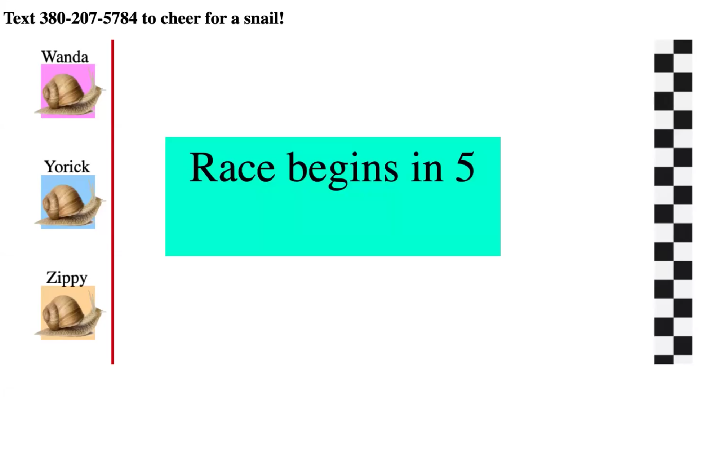
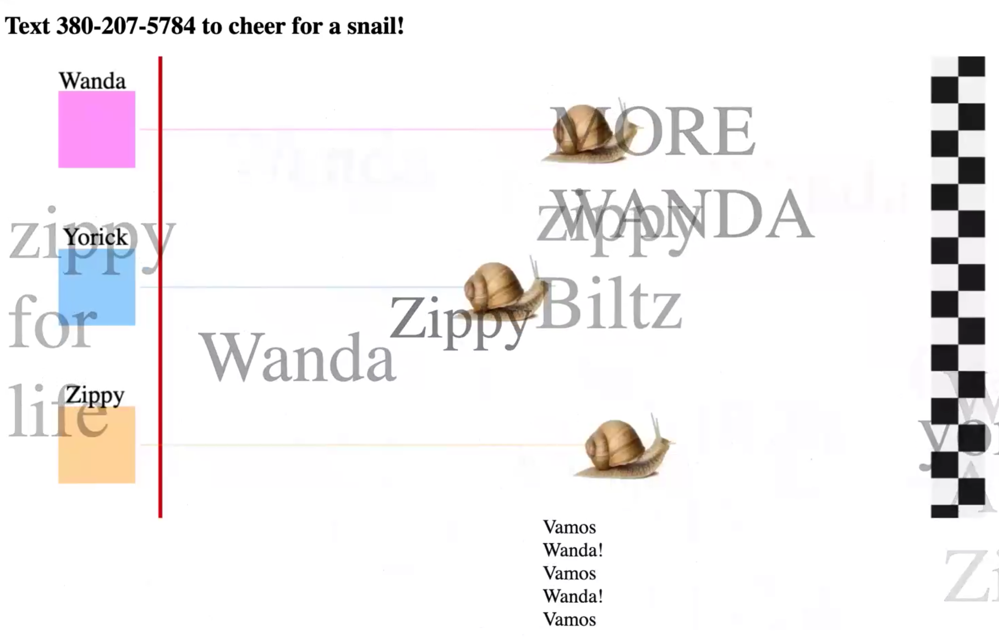
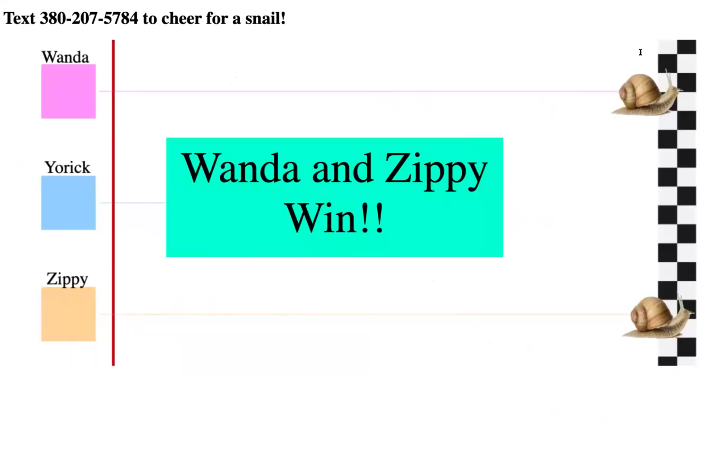

# SMS-Powered  Snail Racing
Watch and cheer (by text) as 3 brave snails fight for dominance of the racetrack.  Cheering for a snail encourages it move faster, but eventually they get distracted and slow down (so keep cheering!).

Entry for Zipwhip Hackathon 2020.





# Requirements
* Zipwhip API phone number and session key (used for inbound SMS)
* Ngrok.io authentication token (used for proxying webhook to local machine)

# Run
Create `env.sh`:
```
export ZW_PHONE_NUMBER="<your ZW phone number>"
export ZW_SESSION_KEY="<your key>"
export NGROK_AUTH_TOKEN="<your token>"
```
or set the values in your shell manually.  Run `tools/start.sh`.

Open `src/frontend/index.html` in a browser to view.

Control the game state by connecting to Redis and publishing to the `commands` channel, e.g.:
```python
from redis import Redis

r = Redis()
r.publish('commands', 'next')
```

# Design
Docker Compose is used to run 4 components:
1. Redis: used for pub/sub channels and storing game state.
2. [Controller](src/controller/): manages game state and listens for events on Redis pub/sub.
3. [Sockets](src/sockets/): asynchronous Websockets server that publishes game state changes to connected clients.
4. [Hooks](src/hooks/): registers Ngrok endpoint as a webhook in the Zipwhip API, then processes incoming webhook data.

The [user interface](src/frontend/) is a Javascript app that connects to the (local) Websockets server and redraws an HTML canvas with updates to the game state.  Cheers and announcments are 'rendered' with CSS animations.

## To-do
* Delete webhook on registration on shutdown
* Customizable snail names
* Better admin interface than publishing to Redis stream
